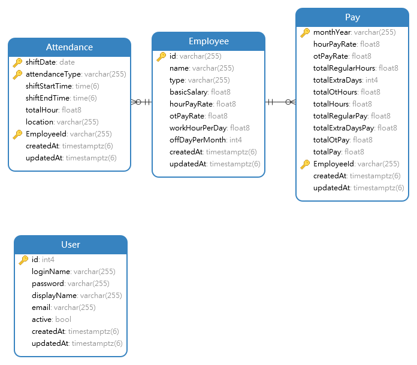

**IMPORTANT!**\
**Please use yarn, instead of npm**\
**Please install prettier extension for auto formatting**

# ERD


# Database and Redis

## 1. Setting Up
Run the following command in the directory (`/<PROJECT>/deploy/docker`) where docker-compose.yml exists<br/>
**Can run the scripts inside API directory as well.**

Init Container
```
docker-compose up -d
```

Destroy Container
```
docker-compose down
```

Stop Container
```
docker-compose stop
```

Start Container
```
docker-compose start -d
```

<br/>

## 2. Init and Seed Data into the database for testing
SQL dumps should be in `./seeds` folder. Dropping and starting the container will reinit the data

**The files will be run in sequence. So DDL should always be 1-DDL.sql**

<br/>

## 3. Exposed Ports
1. PostgreSQL -> 5432
2. Redis -> 6379

## 4. To modify database schema
**Take note that wellac and airple contains the same schema, but for different tenant**

### Minor changes
1. Update the relevant model files, e.g. User.ts
2. Update the sql seed files, e.g. /deploy/db/seeds/01-schema.sql

### Major changes
1. Update the relevant model files, e.g. User.ts, UserProfile.ts
2. Dump the schema file inside docker container with
  ```
    pg_dump --username=<USERNAME> --password --dbname=<DB_NAME> --column-inserts --schema-only --schema=<SCHEMA> --file=<FILE_NAME>
  ```
3. Replace the old seed file

## 5. To add test data
### Small dataset
1. Update 02-data.sql

### Big dataset
1. Insert the data into database or via the application.
2. Dump the data inside docker container with
  ```
    pg_dump --username=<USERNAME> --password --dbname=<DB_NAME> --column-inserts --data-only  --schema=<SCHEMA> --file=<FILE_NAME>
  ```
3. Replace the old seed file

<br />
<br />

# Reactjs Client

## 1. Commands

Init Project
```
yarn
```

Start Project
```
yarn start
```

Add dependencies
```
yarn add <DEPENDENCY> [<DEPENDENCY>]
```

Add dev dependencies
```
yarn add --dev <DEPENDENCY> [<DEPENDENCY>]
```

Remove dependencies
```
yarn remove <DEPENDENCY> [<DEPENDENCY>]
```

<br />

## 2. Project Structure
| Folder Name | type | Description |
|-------------|------|-------------|
| components | Directory | Contains all the shared components. |
| components/ComplexComponent | Directory | Complex component should reside in their own folder with its own nested component. |
| components/ComplexComponent/index.tsx | File | The entry point to ComplexComponent. |
| components/SimpleComponent.tsx | File | Simple component can be just a tsx file. |
| pages | Directory | Contains all the pages. |
| pages/ComplexPage | Directory | Contains all the related files for this page. |
| pages/ComplexPage/index.tsx | File | The entry point to ComplexPage. |
| pages/ComplexPage/components | Directory | Contains all the components for ComplexPage. Complex component should reside in their own folder with its own nested component. |
| pages/SimplePage.tsx | File | Simple page can be just a tsx file. |
| typings | Directory | Contains all the typescript defintions |
| utils | Directory | Contains all the utils function. Utils are to be pure functions. |

<br />
<br />

# Nodejs / Expressjs API

## 1. Commands

Init Project
```
yarn
```

Start Services
```
yarn services:up
```

Destroy Services
```
yarn services:down
```

Reset Services (Reset database)
```
yarn services:reset
```

Start Project
```
yarn build && yarn start
```

Start Project in watch mode
```
yarn watch
```

Start Project in debug mode
```
yarn debug
```

Add dependencies
```
yarn add <DEPENDENCY> [<DEPENDENCY>]
```

Add dev dependencies
```
yarn add --dev <DEPENDENCY> [<DEPENDENCY>]
```

Remove dependencies
```
yarn remove <DEPENDENCY> [<DEPENDENCY>]
```

<br />

## 2. Project Structure
| Name | Description |
| ---- | ----------- |
| config | Passport authentication strategies and login middleware. Add other complex config code here |
| constants | Add all constant values here. Example is errorCode |
| controllers | Controllers define functions that respond to various http requests |
| dao | Daos contains the database queries, which are to be used by service. |
| errors | Contains all the different errors class |
| models | Defines the database and table schema |
| services | Contains all business logic |
| typings | Files that contains only typescript interfaces |
| utils | Utils that are common throughout the app |
| globalErrorHandler.ts | All error thrown and not caught will eventually reach there |
| logger.ts | Logger class to allow logging with metadata |
| routes.ts | The top layer of routes |


<br />

## 3. Input Validation
Project is using express-validator for request input validation.
Validator should be used as declared as a ValidationChain array and be used before the handler (controller method).

**To always use ValidationHandler after the validator**

```
const forgotPassValidator: ValidationChain[] = [
  body('username', 'User name must not be empty')
    .not()
    .isEmpty()
];

const forgotPasswordHandler: RequestHandler = async (req, res, next) => {
  try {
    const { username } = req.body;

    await PasswordService.resetPassword(username);

    return res.sendStatus(OK);
  } catch (err) {
    LOG.error(err);
    return next(err);
  }
};

PasswordController.post('/forgotpassword', forgotPassValidator, ValidationHandler, forgotPasswordHandler);
```

## 4. Authorization
Each module has their own permissions and will typically has the following,

1. ACCESS (Accessing the module)
2. VIEW (Viewing records)
3. CREATE (Creating records)
4. EDIT (Editing records)
5. DELETE (Deleting records)

**Authorizer should always be before Validator and the handler (controller method)**

Usage:
```
const activateUserAuthorizer = createAuthorizer({ module: Modules.USERS, accessLevel: AccessLevels.DELETE });

UserController.get('/', Authentication.AUTHENTICATED, searchUserAuthorizer, searchUsersHandler);
```

# Filename Convention
## Naming filename should match export
 A base filename should exactly match the name of its default export.

    ```javascript
    // file 1 contents
    class CheckBox {
      // ...
    }
    export default CheckBox;

    // file 2 contents
    export default function fortyTwo() { return 42; }

    // file 3 contents
    export default function insideDirectory() {}

    // in some other file
    // bad
    import CheckBox from './checkBox'; // PascalCase import/export, camelCase filename
    import FortyTwo from './FortyTwo'; // PascalCase import/filename, camelCase export
    import InsideDirectory from './InsideDirectory'; // PascalCase import/filename, camelCase export

    // bad
    import CheckBox from './check_box'; // PascalCase import/export, snake_case filename
    import forty_two from './forty_two'; // snake_case import/filename, camelCase export
    import inside_directory from './inside_directory'; // snake_case import, camelCase export
    import index from './inside_directory/index'; // requiring the index file explicitly
    import insideDirectory from './insideDirectory/index'; // requiring the index file explicitly

    // good
    import CheckBox from './CheckBox'; // PascalCase export/import/filename
    import fortyTwo from './fortyTwo'; // camelCase export/import/filename
    import insideDirectory from './insideDirectory'; // camelCase export/import/directory name/implicit "index"
    // ^ supports both insideDirectory.js and insideDirectory/index.js
    ```

  ## Naming camelCase default export
  Use camelCase when you export-default a function. Your filename should be identical to your function’s name.

    ```javascript
    function makeStyleGuide() {
      // ...
    }

    export default makeStyleGuide;
    ```

  ## Naming PascalCase singleton
  Use PascalCase when you export a constructor / class / singleton / function library / bare object.

    ```javascript
    const AirbnbStyleGuide = {
      es6: {
      },
    };

    export default AirbnbStyleGuide;
    ```

  ## Naming Acronyms and Initialisms
  Acronyms and initialisms should always be all uppercased, or all lowercased.

    > Why? Names are for readability, not to appease a computer algorithm.

    ```javascript
    // bad
    import SmsContainer from './containers/SmsContainer';

    // bad
    const HttpRequests = [
      // ...
    ];

    // good
    import SMSContainer from './containers/SMSContainer';

    // good
    const HTTPRequests = [
      // ...
    ];

    // also good
    const httpRequests = [
      // ...
    ];

    // best
    import TextMessageContainer from './containers/TextMessageContainer';

    // best
    const requests = [
      // ...
    ];
    ```

  ## Naming uppercase
  You may optionally uppercase a constant only if it (1) is exported, (2) is a `const` (it can not be reassigned), and (3) the programmer can trust it (and its nested properties) to never change.

    > Why? This is an additional tool to assist in situations where the programmer would be unsure if a variable might ever change. UPPERCASE_VARIABLES are letting the programmer know that they can trust the variable (and its properties) not to change.
    - What about all `const` variables? - This is unnecessary, so uppercasing should not be used for constants within a file. It should be used for exported constants however.
    - What about exported objects? - Uppercase at the top level of export  (e.g. `EXPORTED_OBJECT.key`) and maintain that all nested properties do not change.

    ```javascript
    // bad
    const PRIVATE_VARIABLE = 'should not be unnecessarily uppercased within a file';

    // bad
    export const THING_TO_BE_CHANGED = 'should obviously not be uppercased';

    // bad
    export let REASSIGNABLE_VARIABLE = 'do not use let with uppercase variables';

    // ---

    // allowed but does not supply semantic value
    export const apiKey = 'SOMEKEY';

    // better in most cases
    export const API_KEY = 'SOMEKEY';

    // ---

    // bad - unnecessarily uppercases key while adding no semantic value
    export const MAPPING = {
      KEY: 'value'
    };

    // good
    export const MAPPING = {
      key: 'value'
    };
    ```
